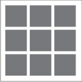

# Lección 29 - Ejercicio Guiado

## El proyecto
Este proyecto se divide en 9 ejercicios:
Se realizó un html por cada grid (ejercicio), por lo que tenemos 9 documentos html.

## HTML y grids:
Tenemos un index y 9 grids

### index
En el index, hay 9 links de acuerdo a cada grid, se le da click y nos mandará al html indicado.

#### Grid 1

#### Grid 2

#### Grid 3

#### Grid 4

#### Grid 5

#### Grid 6

#### Grid 7

#### Grid 8

#### Grid 9

## Desarrollado con:
`HTML` `CSS`

##  Créditos
* [Ruth Salvador](https://github.com/RuthSalvador)
